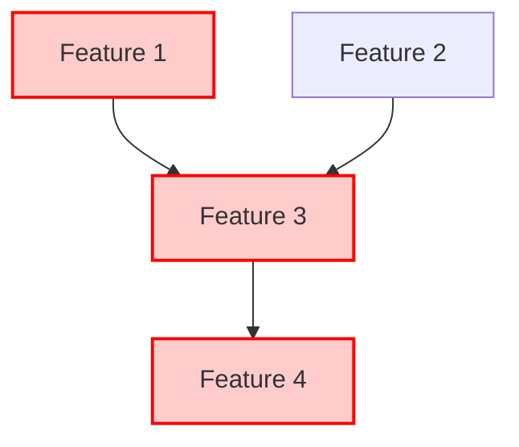
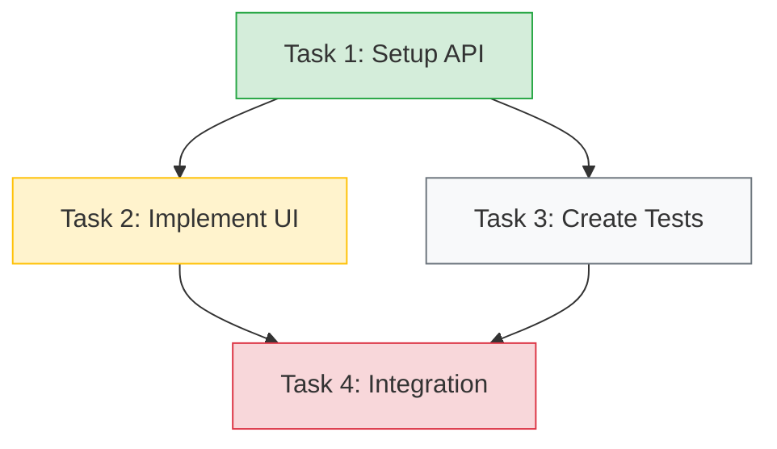

# Feature Status Tracker: [Project Name]

## Feature Progress Summary

| Feature ID | Feature Name | Status | Progress | Tasks Complete | Tests Passing | Priority | Owner |
|-----------|--------------|--------|----------|----------------|---------------|----------|-------|
| F001 | [Feature 1] | [Planning/In Progress/Testing/Complete] | [X%] | [X/Y] | [X/Y] | [High/Medium/Low] | [Name] |
| F002 | [Feature 2] | [Planning/In Progress/Testing/Complete] | [X%] | [X/Y] | [X/Y] | [High/Medium/Low] | [Name] |

## Cross-Feature Dependencies

## Detailed Feature Status

### Feature: [Feature 1] (F001)
- **Owner**: [Name]
- **Status**: [Planning/In Progress/Testing/Complete]
- **Start Date**: [Date]
- **Target Completion**: [Date]
- **Actual Completion**: [Date]
- **Dependencies**: [List of features this feature depends on]
- **Dependents**: [List of features that depend on this feature]

#### Documentation:
- [Link to Feature Specification]
- [Link to Technical Design Document]

#### Progress:
- Requirements: [X%]
- Design: [X%]
- Implementation: [X%]
- Testing: [X%]

#### Cross-Task Dependencies

#### Task Status:

| Task ID | Description | Status | Assigned To | Dependencies | Blockers |
|---------|-------------|--------|-------------|--------------|----------|
| T001 | [Task description] | [Todo/In Progress/Done] | [Name] | [None/Task IDs] | [None/Description] |
| T002 | [Task description] | [Todo/In Progress/Done] | [Name] | [None/Task IDs] | [None/Description] |