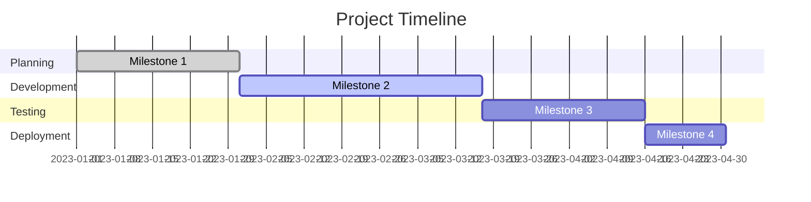

# Project Status Dashboard: [Project Name]

## Executive Summary
- **Start Date**: [Date]
- **Target Completion**: [Date]
- **Current Phase**: [Planning/Development/Testing/Deployment]
- **Overall Progress**: [X%]
- **Status**: [On Track/At Risk/Delayed]
- **Key Achievements**: [Brief summary of recent key achievements]
- **Major Concerns**: [Brief summary of major concerns]

## Milestone Status
| Milestone | Due Date | Status | Progress | Owner |
|-----------|----------|--------|----------|-------|
| [Milestone 1] | [Date] | [On track/At risk/Delayed] | [X%] | [Name] |
| [Milestone 2] | [Date] | [On track/At risk/Delayed] | [X%] | [Name] |

## Current Blockers & Issues
| ID | Description | Impact | Owner | Resolution Plan | Target Date |
|----|-------------|--------|-------|-----------------|-------------|
| BL001 | [Blocker description] | [High/Medium/Low] | [Name] | [Plan] | [Date] |
| BL002 | [Blocker description] | [High/Medium/Low] | [Name] | [Plan] | [Date] |

## Recent Activity
- [Date]: [Activity description]
- [Date]: [Activity description]

## Quality Metrics
- **Test Coverage**: [X%]
- **Technical Debt Score**: [X/100]

## Budget & Cost Tracking
- **Total Budget**: [$X]
- **Spent to Date**: [$Y] ([Z%] of budget)
- **Projected Final Cost**: [$A]
- **Cost Variance**: [$B] ([Over/Under] budget by [C%])

## Team Metrics
- **Velocity**: [X] story points (Trend: [Increasing/Stable/Decreasing])
- **Capacity Utilization**: [X%]
- **Team Morale**: [High/Medium/Low]

## Risk Summary
| Risk Category | Count | Trend |
|---------------|-------|-------|
| Technical | [X] | [↑/↓/→] |
| Resource | [X] | [↑/↓/→] |
| Schedule | [X] | [↑/↓/→] |
| External | [X] | [↑/↓/→] |

## Next Steps & Action Items
| ID | Action | Owner | Due Date | Status |
|----|--------|-------|----------|--------|
| A001 | [Action description] | [Name] | [Date] | [Not Started/In Progress/Complete] |
| A002 | [Action description] | [Name] | [Date] | [Not Started/In Progress/Complete] |
